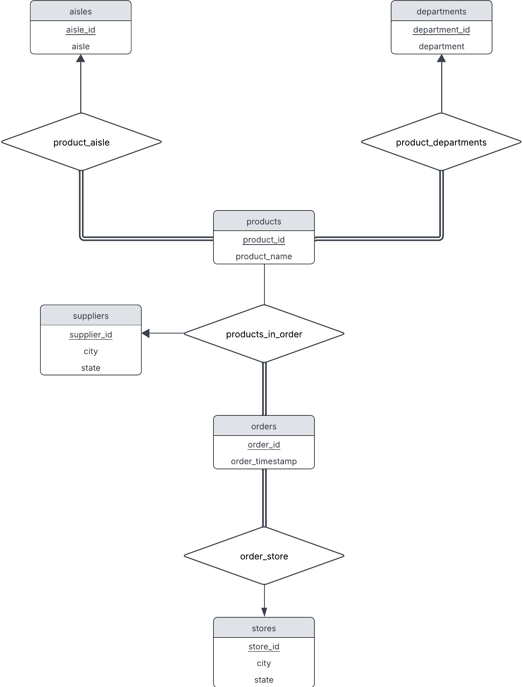

# Supermarket Data Analysis System

## Overview
This application helps supermarket analysts and managers optimize inventory and track sales trends. It provides both a client-facing interface for data analysis and an admin interface for managing products and order updates.

## Prerequisites
Before running the application, ensure you have the following:
- **Python 3.10** (This system was only tested on Python 3.10, and functionality is not guaranteed on other versions.)
- **MySQL Server**
- **Required Python Packages**: Install dependencies using:
  ```bash
  pip3 install -r requirements.txt
  ```
- **Dataset**: The data, which has been precleaned (from original Kaggle format)
  is in csv format in the `data/` folder. No further data cleaning will be necessary. The data will not be included in the CodePost submission (because the file sizes are too large); so, please go to the repository link to download the data in the `data/` directory. Simply download the data folder, and then place it into the directory in which this project is located in your computer. Do not remove the csv files from the `data/` folder. The SQL code assumes that a folder called `data/` with the csv file exists to load in the data.
  
Note: running the cleaning files in `data_cleaning/` may not work, since they assume a preexisting state of the data that we didn't check for before running. Thus, they are mainly there for users who are curious how our data cleaning worked, but they likely don't work on the current state of the data.


## Database Setup
To set up the database, run the following SQL commands in order:
```sql
DROP DATABASE IF EXISTS final;
CREATE DATABASE final;
use final;
source setup.sql;
source load-data.sql;
source setup-passwords.sql;
source setup-routines.sql;
source grant-permissions.sql;
source queries.sql;
```

Note: Some warnings may appear if the `DROP ... IF EXISTS ...` is checking if a nonexistent entity is being checked. This is okay, and you may ignore these possible warnings.


## Running the Application

### Users
These are the credentials for users we defined in `setup-passwords.sql`. This is for the client/python side, not sql side. Admins would be employees like supermarket owners who we would want to give full permissions to. Thus, the admin application is exposed to information like product_ids that we wouldn't want to expose, nor is necessary, to client users. Users, like bob, would be a client with limited access and functionality.

Admins can use both the admin and client application. Clients can only use the client application.

#### Admin user(s):

Username: `alice`

Password: `password`

#### Client user(s):

Username: `bob`

Password `password`


### Admin Interface
To start the admin application, run:
```bash
python3 app_admin.py
```
Admin users can:
- Add new orders
- Change product names

### Client Interface
To start the client application, run:
```bash
python3 app_client.py
```
Client users can:
- Query store efficiency ratings
- Query popular products
- Query popular aisles

## Expected User Flow
1. A user (either admin or client) launches the application (`app_admin.py` or `app_client.py`)
2. The system prompts for login credentials.
3. Upon successful authentication:
   - **Clients** can query supermarket sales data.
   - **Admins** can modify product names and add new order data
4. The user selects an option from the menu and interacts accordingly.
5. The user can continue interacting or exit the system.

## Security & Permissions
- All client accounts interact with the SQL database through the 'appclient'@'localhost' user in the hidden backend.
- All admin accounts interact with the SQL database through the 'appadmin'@'localhost' user in the hidden backend.
- It is assumed that admin accounts/users have all permissions to the database.
- Authentication is enforced before accessing any functionality.

## MySQL Debugging
Since we are using CSV files for data import, enter MySQL with:
```bash
sudo mysql --local-infile=1
```

If not already on, turn on file reading on the server side with the following command
```sql
SET GLOBAL local_infile = 1;
```

If at any point during testing the server freezes for any reason, simply restart the server with this command:
```bash
sudo systemctl restart mysql
```

## ER Diagram
For those curious about our ER diagram setup, here it is:
